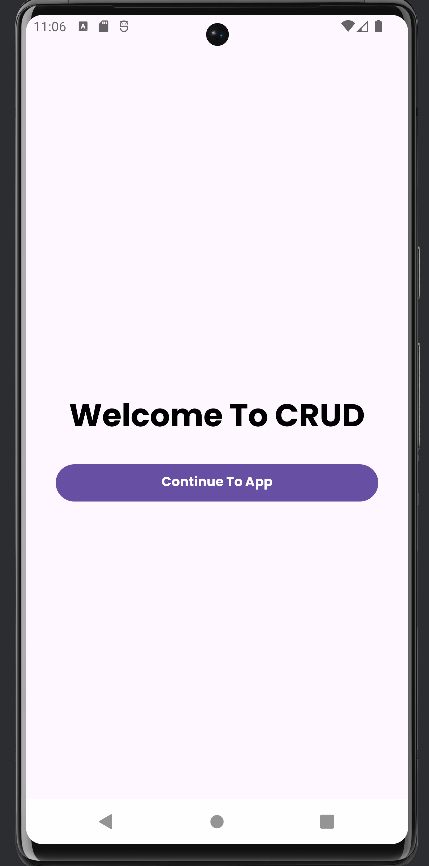
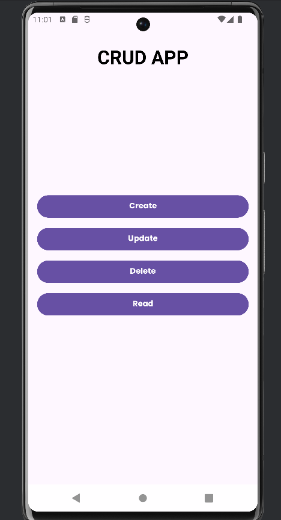
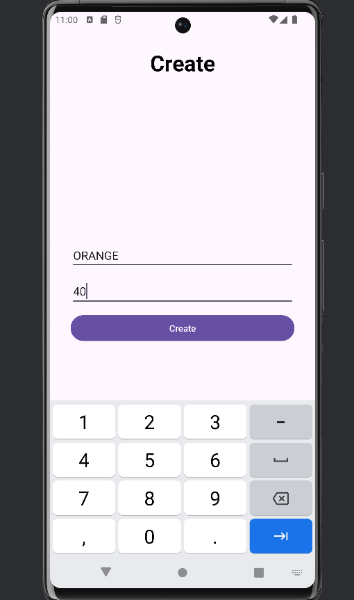
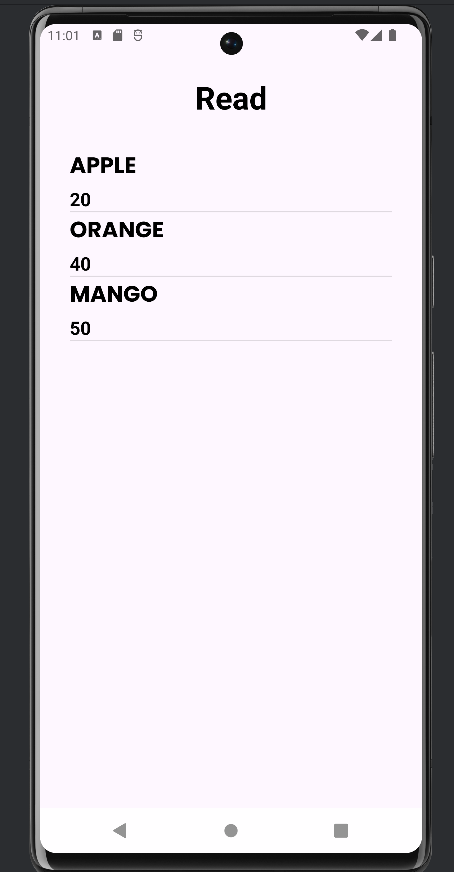
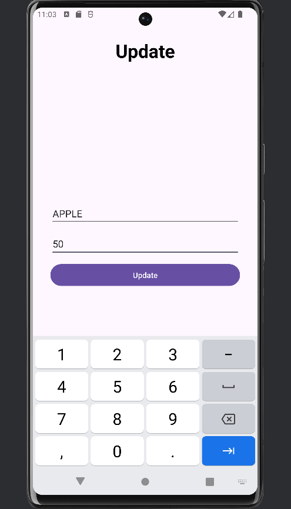
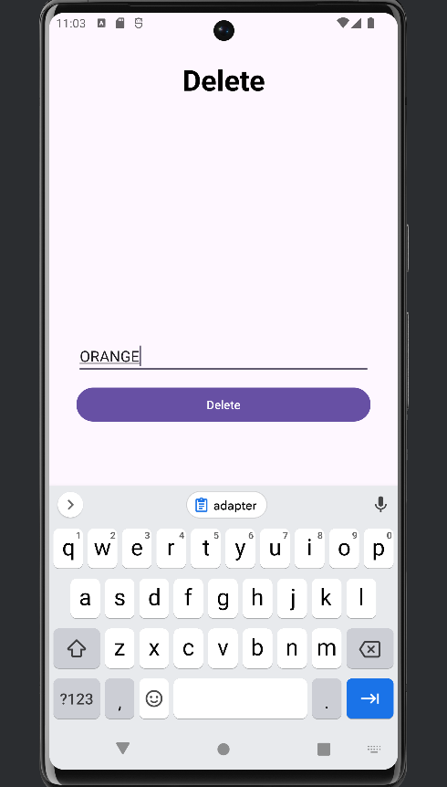

# Android CRUD App with SQLite

This project is a simple Android app demonstrating basic **CRUD** (Create, Read, Update, Delete) operations using **SQLite** as the database. The app allows users to manage a list of items, where each item has a **name** and **quantity**.

Watch the Tuturial (Malayalam) and build the app yourself with step by step guide!! <a href="https://youtube.com/playlist?list=PL-OHWgHd2g6-EwiQ0vcI6gxd9_1feEYWW&si=HN8S2tREH03S-vAe">Click here</a>
## Features

- **Create**: Add a new item with a name and quantity.
- **Read**: View all items in a `ListView` with item names and their quantities displayed.
- **Update**: Modify the quantity of an existing item by providing its name.
- **Delete**: Remove an item from the list by providing its name.

## Screenshots
Here's a glimpse of what you can expect from this app:

| Welcome Screen | Home Screen |
|-------------|--------------|
|  |  |

| Create Screen | Read Screen |
|-------------|---------------|
|  |  |

| Update Screen | Delete Screen |
|------------------------|------------------|
|  |  |

## Getting Started

### Prerequisites
- Android Studio (latest version recommended)
- Basic understanding of Android development, Java, and SQLite
- An emulator or Android device to run the app

### Installation

1. **Clone the repository**:
   ```bash
   git clone https://github.com/sreekesh-k/Android-CRUD-App.git
   ```

2. **Open the project**:
   - Open Android Studio and select the cloned project folder.

3. **Build and run**:
   - Connect an Android device or start an emulator.
   - Click the run button in Android Studio to install and launch the app on your device.

### SQLite Helper Class

This project uses an `SQLiteHelper` class to handle all database operations such as creating tables, inserting, reading, updating, and deleting items.

Example methods in `DbHelper.java`:

```java
public boolean createItem(String name, int quantity) { /* ... */ }
public Cursor readAllItems() { /* ... */ }
public boolean updateItem(String name, int quantity) { /* ... */ }
public boolean deleteItem(String name) { /* ... */ }
```

### Activities Overview

- **WelcomeActivity**: Displays a welcome screen with a button to continue to the main app.
- **MainActivity**: Contains buttons to navigate to the Create, Read, Update, and Delete activities.
- **CreateActivity**: Allows the user to add a new item by providing its name and quantity.
- **ReadActivity**: Displays all items in a `ListView`, showing the name and quantity of each item.
- **UpdateActivity**: Allows the user to update the quantity of an existing item by providing its name.
- **DeleteActivity**: Allows the user to delete an item by providing its name.

### Custom ListView Adapter

In `ReadActivity`, a custom `ArrayAdapter` or `SimpleAdapter` is used to bind the data to the `ListView`, displaying both the item name and quantity.

## Contributing

Contributions are welcome! If you have suggestions or improvements, please open an issue or submit a pull request.
